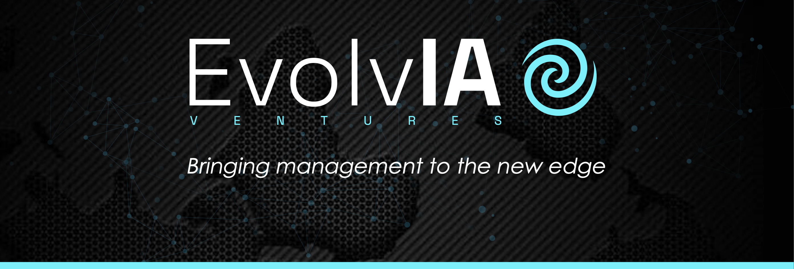

# 🌐 EvolvIA Ventures · Landing Page construida con Astro + Tailwind

**Deploy público:** [https://evolv-ia-landing-page.vercel.app/](https://evolv-ia-landing-page.vercel.app/)

---

## 🧩 Descripción general

**EvolvIA Ventures** es una landing page desarrollada con **Astro** y **Tailwind CSS**, enfocada en comunicar la propuesta de valor de EvolvIA como sistema de transformación estratégica para organizaciones.  
El proyecto combina diseño minimalista, arquitectura modular y un enfoque en la experiencia visual controlada mediante tokens de color y tipografía.

El objetivo fue crear una base escalable y optimizada, donde cada componente (Hero, Features, Content, CTA) refleje coherencia estética y semántica, asegurando al mismo tiempo buen rendimiento y accesibilidad.

---

## ⚙️ Stack tecnológico

- **Astro** — Framework híbrido orientado a componentes y contenido estático.
- **Tailwind CSS** — Utilidades de diseño para escalabilidad visual.
- **Node.js (v18+)** — Entorno de ejecución del build.
- **Vercel** — Hosting y automatización del despliegue continuo (CI/CD).
- **TypeScript + Astro Components (.astro)** — Tipado y estructura modular.
- **twMerge** — Fusión inteligente de clases Tailwind.
- **AstroWind** — Base inicial adaptada y personalizada.

---

## 🚀 Cómo ejecutar el proyecto

```bash
# Clonar el repositorio
git clone https://github.com/franz8818/EvolvIA-landing-page.git

# Entrar a la carpeta
cd EvolvIA-landing-page

# Instalar dependencias
npm install

# Ejecutar en modo desarrollo
npm run dev

# Compilar para producción
npm run build

# Previsualizar el build
npm run preview
```

---

## 🏗️ Arquitectura del proyecto

Astro divide la estructura del sitio en **layouts**, **componentes** y **páginas**:

```
src/
 ├─ assets/                → Imágenes, íconos y fuentes.
 ├─ components/            → Componentes de UI y widgets reutilizables.
 │   ├─ ui/                → Elementos base (Button, Headline, SpiralGraphic...)
 │   └─ widgets/           → Secciones completas (Hero, Features2, Content...)
 ├─ layouts/               → Estructuras de página (PageLayout.astro).
 ├─ pages/                 → Páginas principales del sitio.
 ├─ styles/                → CustomStyles.astro (tokens y fuentes).
 └─ config/                → Configuración global (astrowind.config, tailwind.config.js)
```

**Lógica principal:**  
Cada widget recibe `props` y `slots`, permitiendo personalizar fondos (`slot="bg"`), imágenes (`slot="image"`) y contenido (`slot="content"`) según la sección.  
Se usaron fragmentos (`<Fragment slot="...">`) para inyectar contenido dinámico y SVGs (como `SpiralGraphic.astro`) directamente en el layout sin romper el flujo de renderizado.

---

## 🎨 Paleta de colores y tokens de diseño

| Rol / Token | Variable CSS | Valor HEX / RGB | Descripción |
|--------------|--------------|------------------|--------------|
| **Primary** | `--aw-color-primary` | `#01FFFF` | Color principal para textos destacados y acentos. |
| **Secondary** | `--aw-color-secondary` | `#FA119D` | Contraste fuerte usado en bordes o elementos de énfasis. |
| **Accent** | `--aw-color-accent` | `#40F2FE` | Complementario al color principal, usado para brillos o hover states. |
| **Emerald** | `--aw-color-emerald` | `#0B7069` | Verde simbólico asociado al propósito evolutivo. |
| **Heading Text** | `--aw-color-text-heading` | `#03292B` | Color principal de los títulos. |
| **Default Text** | `--aw-color-text-default` | `#03292B` | Color base de párrafos y cuerpo. |
| **Muted Text** | `--aw-color-text-muted` | `#03292B` | Variación más suave del texto principal. |
| **Page Background** | `--aw-color-bg-page` | `rgb(255, 255, 255)` | Fondo principal de la landing. |
| **Features2 Background** | `--aw-color-page-features2` | `#03292C` | Fondo de la sección “¿Qué hacemos?”. |
| **Features2 Card Dark** | `--aw-color-page-features2-dark` | `#021E22` | Fondo de las tarjetas de Features2. |

---

## 🧩 Tipografías

| Tipo | Variable CSS | Fuente | Uso principal |
|------|---------------|--------|----------------|
| **Sans / Base** | `--aw-font-sans` | Montserrat | Texto base, párrafos, botones. |
| **Heading / Display** | `--aw-font-heading` | SpaceGrotesk | Títulos principales y headers. |

---

## 🧱 Componentes principales

| Componente | Descripción |
|-------------|-------------|
| **Hero.astro** | Sección inicial con CTA principal y fondo heroico. |
| **Features2.astro** | Sección de características “¿Qué hacemos?”. |
| **ItemGrid2.astro** | Renderiza tarjetas con fondo `bg-page-features2-dark`. |
| **Content.astro** | Bloques de contenido reversible con `isReversed`. |
| **SpiralGraphic.astro** | SVG generado por código, usado en `slot="image"`. |
| **WidgetWrapper.astro** | Contenedor con soporte para fondos y overlays. |

---

## 🧠 Proceso de desarrollo y decisiones técnicas

- Se desactivó el **dark mode automático** del sistema forzando `UI.theme = 'light:only'` para cumplir pedido del cliente.  
- Se implementaron **tokens de color en CSS variables** y se mapearon a Tailwind mediante `extend.colors`.  
- Se ajustó el flujo de slots en `<Content>` para evitar superposición visual del Footer.  
- `twMerge` permitió combinar clases dinámicamente sin romper la herencia de estilos.  
- Se integró un SVG personalizado (`SpiralGraphic.astro`) inyectado en runtime sin pérdida de semántica ni accesibilidad.

---

## 🚀 Aprendizajes clave

- Entendí cómo Astro maneja los **slots y props**, permitiendo layouts flexibles y declarativos.  
- Aprendí a controlar **el dark mode** desde scripts y configuración (`astrowind.config.js`).  
- Profundicé en el uso de **Tailwind extend** y el mapeo de tokens globales (`--aw-color-*`).  
- Experimenté con **SVGs generados por código**, optimizándolos para rendimiento y escalabilidad.  
- Logré comprender mejor la relación entre **estructura semántica y diseño visual modular**.

---

## 📅 Estado actual

✅ Landing funcional con diseño adaptable y colores institucionales.  
🧩 Dark mode desactivado correctamente.  
⚙️ Pendiente: documentar contrastes WCAG y animaciones opcionales en SVG.

---

**Desarrollado por [Franz Seidel](https://github.com/franz8818) — Front-End Developer**

---

© 2025 EvolvIA · Proyecto profesional y de desarrollo web con Astro.
